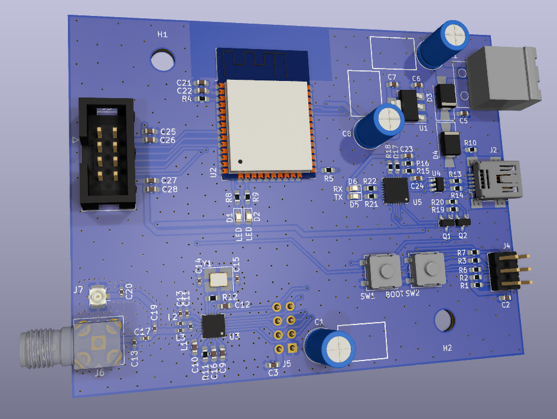

# moles-integ-dtu-hw

This is a small module for use of ESP32 with a sub-GHZ transceiver, mainly intended to serve as a base for AhoyDTU and OpenDTU.

## Hardware

The module looks like the following.

You can find the schematics in the docs folder.

You can also access the [iBom](https://htmlpreview.github.io/?https://github.com/the78mole/moles-integ-dtu-hw/blob/main/docs/ibom.html) of this project for easier manual assembly.

## Software

You can deploy [OpenDTU](https://github.com/tbnobody/OpenDTU) or [AhoyDTU](https://github.com/lumapu/ahoy/) on it and you can assemble the RF-Part or add one of the NRF24L01+ modules from many sources to it. Just ensure, that the pinout it matching the one on this board.

## Improvements

### Add PA+LNA to RF side

To increase the performance of the module, as you can buy modules from different suppliers, there could be added a PA+LNA RF frontend. 
You can find [more information on instructables](https://www.instructables.com/How-to-Build-Your-Own-NRF24L01palna-Module/).
