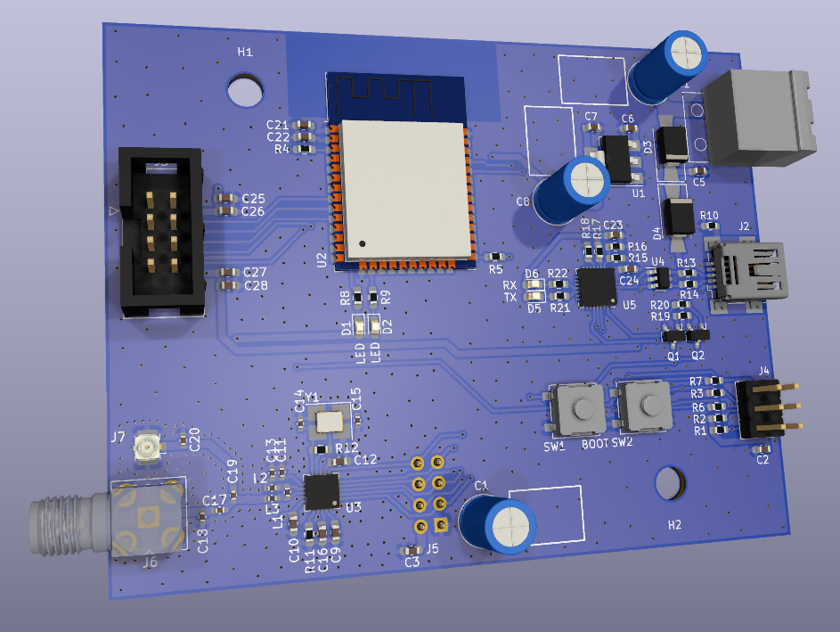

# Moles Integration DTU Hardware

[](LICENSE)
[](https://kicad.org/)

This is a specialized integration module that combines an ESP32 microcontroller with a sub-GHz transceiver, primarily designed as a hardware foundation for [AhoyDTU](https://github.com/lumapu/ahoy/) and [OpenDTU](https://github.com/tbnobody/OpenDTU) solar inverter monitoring systems.

## Table of Contents

- [Features](#features)
- [Hardware Specifications](#hardware-specifications)
- [Hardware Assembly](#hardware-assembly)
- [Pin Mapping](#pin-mapping)
- [Software Installation](#software-installation)
- [Configuration](#configuration)
- [Troubleshooting](#troubleshooting)
- [Performance Specifications](#performance-specifications)
- [Improvements](#improvements)
- [Contributing](#contributing)
- [License](#license)
- [Resources](#resources)

## Features

- **ESP32 Integration**: Full ESP32 development board compatibility
- **Sub-GHz Communication**: NRF24L01+ transceiver support for solar inverter communication
- **Compact Design**: Optimized PCB layout for minimal footprint
- **Open Source**: Full KiCad project files and documentation
- **DTU Ready**: Pre-configured for AhoyDTU and OpenDTU deployment
- **RF Performance**: Optimized RF design with optional PA+LNA enhancement
- **Easy Assembly**: Interactive BOM and detailed assembly instructions

## Hardware Specifications

### Core Components

| Component | Specification | Description |
|-----------|--------------|-------------|
| **Microcontroller** | ESP32-WROOM-32 | Dual-core Xtensa LX6, WiFi & Bluetooth |
| **RF Transceiver** | NRF24L01+ | 2.4GHz ISM band, up to 2Mbps |
| **Power Supply** | 3.3V/5V compatible | On-board voltage regulation |
| **Flash Memory** | 4-16MB (ESP32 internal) | Program and data storage, depending on chosen WROOM-Module |
| **RAM** | 520KB (ESP32 internal) | SRAM for program execution |

### Physical Specifications

- **PCB Dimensions**: ~70mm x 50mm (approximate)
- **Layer Count**: 2-layer PCB
- **Operating Temperature**: -40°C to +85°C
- **Power Consumption**: 
  - Active: ~160mA @ 3.3V
  - Deep Sleep: <10µA
  - WiFi TX: ~200mA peak

### Electrical Specifications

- **Input Voltage**: 3.3V - 5V DC
- **I/O Voltage**: 3.3V logic level
- **Current Rating**: Max 1A total
- **ESD Protection**: Integrated on critical pins

## Hardware Assembly

### Required Tools

- Soldering iron (temperature controlled, 350-400°C)
- Solder (60/40 or lead-free 0.6-0.8mm)
- Flux
- Tweezers
- Magnifying glass or microscope
- Multimeter
- Hot air station (optional, for SMD components)

### Bill of Materials

For a complete and up-to-date bill of materials, please refer to the [Interactive BOM](https://htmlpreview.github.io/?https://github.com/the78mole/moles-integ-dtu-hw/blob/main/docs/ibom.html) which provides:

- Complete component list with values and package sizes
- Component placement visualization
- Interactive component highlighting
- Supplier information and part numbers

### Assembly Instructions



1. **Preparation**
   - Download and print the [PCB documentation](docs/Moles-Integ-DTU-HW.pdf)
   - Gather all components per the BOM
   - Prepare your workspace with proper lighting and ventilation

2. **SMD Component Assembly**
   - Start with the smallest components (resistors, capacitors)
   - Use flux liberally for better solder flow
   - Work from inside-out to avoid shadowing larger components
   - Double-check component orientations, especially for ICs

3. **Through-Hole Components**
   - Install connectors and larger components
   - Ensure proper mechanical fit before soldering
   - Clean flux residue with isopropyl alcohol

4. **ESP32 Module Installation**
   - Align the ESP32-WROOM-32 module carefully
   - Solder all pads ensuring good electrical contact
   - Verify no shorts between adjacent pins

5. **NRF24L01+ Socket/Module**
   - Install either the socket for removable modules or solder the NRF24L01+ directly
   - Verify pin alignment matches the board silkscreen
   - Test continuity of critical connections (VCC, GND, SPI pins)

6. **Quality Control**
   - Visual inspection for solder bridges
   - Continuity testing of power rails
   - Check for correct component placement

### Assembly Verification

Before first power-up:

```bash
# Basic continuity checks
- VCC to GND: Should be open (high resistance)
- 3.3V rail continuity
- SPI bus connectivity (MOSI, MISO, SCK, CS)
- ESP32 programming pins accessibility
```

## Pin Mapping

### ESP32 to NRF24L01+ Connections

| ESP32 Pin | Function | NRF24L01+ Pin | Description |
|-----------|----------|---------------|-------------|
| GPIO18 | SPI_SCK | SCK | SPI Clock |
| GPIO23 | SPI_MOSI | MOSI | SPI Master Out |
| GPIO19 | SPI_MISO | MISO | SPI Master In |
| GPIO5 | SPI_CS | CSN | SPI Chip Select |
| GPIO4 | GPIO | CE | Chip Enable |
| GPIO2 | GPIO | IRQ | Interrupt Request |
| 3V3 | Power | VCC | 3.3V Power Supply |
| GND | Ground | GND | Ground |

### Additional GPIO Mapping

| ESP32 Pin | Function | Description |
|-----------|----------|-------------|
| GPIO0 | BOOT | Boot mode selection |
| GPIO2 | LED | Status LED (if populated) |
| EN | Reset | External reset input |
| GPIO1 | UART_TX | Serial transmit |
| GPIO3 | UART_RX | Serial receive |

## Software Installation

### Prerequisites

- **ESP-IDF**: Version 4.4+ or Arduino IDE with ESP32 support
- **PlatformIO**: Recommended for advanced development
- **Git**: For cloning repositories
- **USB-to-Serial Driver**: CP210x or CH340 depending on your board

### Installing OpenDTU

OpenDTU is the recommended firmware for this hardware platform.

1. **Clone the Repository**
   ```bash
   git clone https://github.com/tbnobody/OpenDTU.git
   cd OpenDTU
   ```

2. **Configure PlatformIO**
   ```bash
   # Install PlatformIO if not already installed
   pip install platformio
   
   # Build the project
   pio run -e generic_esp32
   ```

3. **Flash the Firmware**
   ```bash
   # Connect the board via USB
   # Put ESP32 in programming mode (hold BOOT, press RESET, release BOOT)
   pio run -e generic_esp32 -t upload
   ```

### Installing AhoyDTU

Alternative firmware option with different feature set.

1. **Clone and Build**
   ```bash
   git clone https://github.com/lumapu/ahoy.git
   cd ahoy
   pio run -e esp32-wroom32-devkit
   ```

2. **Configuration**
   - Edit `config.h` for your specific inverter setup
   - Configure WiFi credentials
   - Set up MQTT broker details

### First Boot Configuration

1. **WiFi Setup**
   - Connect to the ESP32 access point (typically "OpenDTU-XXXX")
   - Navigate to the web interface
   - Configure your WiFi network credentials

2. **Inverter Configuration**
   - Enter your inverter serial numbers
   - Configure communication parameters
   - Set up monitoring intervals

## Configuration

### Web Interface

After successful installation, access the web interface:

- **Default IP**: Check your router's DHCP table or use mDNS
- **Default URL**: `http://opendtu.local` or `http://[IP_ADDRESS]`
- **Default Credentials**: Usually no authentication required initially

### Key Configuration Parameters

```yaml
# WiFi Configuration
wifi:
  ssid: "YourNetworkName"
  password: "YourNetworkPassword"
  
# MQTT Configuration
mqtt:
  broker: "192.168.1.100"
  port: 1883
  topic_prefix: "solar"
  
# Inverter Configuration
inverters:
  - serial: 1234567890
    name: "Inverter 1"
    type: "HM-600"
```

### Performance Tuning

For optimal RF performance:

1. **Antenna Placement**
   - Keep antenna away from metal objects
   - Ensure clear line of sight to inverters
   - Consider external antenna for better range

2. **Power Management**
   - Configure deep sleep modes for battery operation
   - Optimize polling intervals
   - Use efficient data transmission protocols

## Troubleshooting

### Common Issues

#### No WiFi Connection
```bash
# Check if ESP32 is in AP mode
# Look for "OpenDTU-XXXX" or "AhoyDTU-XXXX" network
# Connect and configure via web interface
```

#### RF Communication Problems
1. **Check NRF24L01+ Module**
   - Verify power supply (3.3V)
   - Check SPI connections
   - Ensure proper antenna connection

2. **Inverter Communication**
   - Verify inverter serial numbers
   - Check RF channel configuration
   - Monitor signal strength indicators

#### Programming Issues
```bash
# Put ESP32 in programming mode
# Hold BOOT button while pressing RESET
# Release RESET, then release BOOT
# Attempt upload again
```

### Diagnostic Commands

```bash
# Monitor serial output
pio device monitor -b 115200

# Check memory usage
pio run -t size

# Clean build artifacts
pio run -t clean
```

### Debug Output

Enable debug logging in your firmware configuration:

```cpp
// In Arduino IDE or PlatformIO
#define DEBUG_LEVEL ARDUHAL_LOG_LEVEL_DEBUG
```

## Performance Specifications

### RF Performance

| Parameter | Typical Value | Maximum Value | Unit |
|-----------|---------------|---------------|------|
| **Transmit Power** | 0 | +4 | dBm |
| **Receive Sensitivity** | -85 | -90 | dBm |
| **Range (Line of Sight)** | 100 | 200 | meters |
| **Range (Indoor)** | 20 | 50 | meters |
| **Data Rate** | 250k | 2M | bps |

### Power Consumption

| Mode | Current | Duration | Notes |
|------|---------|----------|-------|
| **Active WiFi** | 160mA | Continuous | Normal operation |
| **RF TX Peak** | 200mA | <1ms | During transmission |
| **Light Sleep** | 15mA | Variable | WiFi maintained |
| **Deep Sleep** | <10µA | Hours | Wake on timer/GPIO |

### Environmental Specifications

- **Operating Temperature**: -40°C to +85°C
- **Storage Temperature**: -65°C to +125°C
- **Humidity**: 5% to 95% RH (non-condensing)
- **Altitude**: Up to 3000m above sea level

## Improvements

### Hardware Enhancements

#### PA+LNA RF Frontend

To significantly improve RF performance and range:


**Benefits:**
- Increased transmit power (+20dBm typical)
- Improved receiver sensitivity (-100dBm)
- Extended range (up to 1km line of sight)

**Implementation:**
1. **Hardware Modification**
   - Add RFX2401C or similar PA+LNA module
   - Modify RF trace routing
   - Add antenna switching control

2. **Parts Required**
   - RFX2401C PA+LNA module
   - Additional control GPIOs
   - Modified PCB or breakout board

3. **Assembly Guide**
   - Follow the detailed guide: [NRF24L01+PA+LNA Module Build](https://www.instructables.com/How-to-Build-Your-Own-NRF24L01palna-Module/)
   - Ensure proper shielding and ground plane
   - Test RF performance with spectrum analyzer

#### Alternative Power Options

1. **Battery Operation**
   - Add LiPo battery connector
   - Implement charging circuit
   - Power management optimization

2. **PoE Support**
   - Add IEEE 802.3af PoE module
   - Galvanic isolation
   - Surge protection

#### Future Hardware Revisions

- **USB-C Connector**: Modern connector standard
- **On-board Antenna**: Integrated PCB antenna option
- **Status LEDs**: Visual feedback for operation modes
- **External Antenna Connector**: U.FL or SMA connector
- **Environmental Sensors**: Temperature, humidity monitoring

### Software Enhancements

#### Advanced Features
- **OTA Updates**: Over-the-air firmware updates
- **Data Logging**: Local storage of historical data
- **Advanced Scheduling**: Complex polling schedules
- **Multi-Protocol Support**: Support for additional inverter protocols

#### Integration Options
- **Home Assistant**: Native integration
- **InfluxDB**: Time-series database support
- **Grafana**: Advanced visualization
- **Node-RED**: Visual programming interface

## Contributing

We welcome contributions to improve this project! Here's how you can help:

### Development Workflow

1. **Fork the Repository**
   ```bash
   git clone https://github.com/[your-username]/moles-integ-dtu-hw.git
   cd moles-integ-dtu-hw
   ```

2. **Create Feature Branch**
   ```bash
   git checkout -b feature/your-improvement
   ```

3. **Make Changes**
   - Follow KiCad design rules
   - Update documentation
   - Test thoroughly

4. **Submit Pull Request**
   - Provide clear description
   - Include test results
   - Reference related issues

### Design Guidelines

#### Hardware Design
- **KiCad Version**: Use latest stable version
- **Design Rules**: Follow IPC standards
- **Component Selection**: Prefer widely available parts
- **Documentation**: Update schematic and PCB documentation

#### Documentation
- **Markdown Format**: Use standard markdown
- **Images**: Optimize file sizes, use PNG/JPG
- **Links**: Verify all external links
- **Accuracy**: Test all instructions

### Bug Reports

When reporting bugs, please include:

- **Hardware Version**: PCB revision and component details
- **Software Version**: Firmware version and configuration
- **Environment**: Operating conditions and setup
- **Reproduction Steps**: Clear steps to reproduce the issue
- **Expected vs Actual**: What should happen vs what actually happens

### Feature Requests

For new features:

- **Use Case**: Describe the problem you're trying to solve
- **Proposed Solution**: Your suggested approach
- **Alternatives**: Other solutions you've considered
- **Impact**: Who would benefit from this feature

## License

This project is licensed under the [TAPR Open Hardware License](LICENSE). This means:

### You are free to:
- **Study** the design and understand how it works
- **Modify** the design for your own purposes
- **Distribute** copies of the design
- **Distribute** modified versions of the design

### Under the following conditions:
- **Attribution**: Credit the original designers
- **Share Alike**: Distribute modifications under the same license
- **Documentation**: Provide design files in open formats
- **Notice**: Include license notices in distributions

### Commercial Use
Commercial use is permitted under the TAPR OHL, but please review the full license terms for specific requirements regarding documentation and attribution.

## Resources

### Official Documentation
- **Schematics**: [PDF Documentation](docs/Moles-Integ-DTU-HW.pdf)
- **Interactive BOM**: [iBOM Tool](https://htmlpreview.github.io/?https://github.com/the78mole/moles-integ-dtu-hw/blob/main/docs/ibom.html)
- **Production Workflow**: [Automated Production Files](docs/PRODUCTION_WORKFLOW.md)
- **Versioning & CI/CD**: [Semantic Versioning and Workflows](docs/VERSIONING_AND_CI.md)
- **KiCad Files**: Complete project files in repository

### Related Projects
- **OpenDTU**: [Advanced DTU firmware](https://github.com/tbnobody/OpenDTU)
- **AhoyDTU**: [Alternative DTU firmware](https://github.com/lumapu/ahoy/)
- **ESP32 Documentation**: [Official ESP32 docs](https://docs.espressif.com/projects/esp-idf/en/latest/)
- **NRF24L01+**: [Datasheet and examples](https://www.nordicsemi.com/products/nrf24l01)

### Community Resources
- **Solar Inverter Monitoring**: [Community forums and guides](https://forum.fhem.de)
- **ESP32 Community**: [ESP32 developer resources](https://esp32.com/)
- **KiCad Community**: [PCB design resources](https://kicad.org/community/)

### Supplier Information
- **PCB Manufacturing**: Recommended suppliers for small batch production
- **Component Sourcing**: Parts availability and alternative components
- **Assembly Services**: Professional assembly options

### Development Tools
- **KiCad**: [Free PCB design software](https://kicad.org/)
- **PlatformIO**: [Advanced embedded development](https://platformio.org/)
- **ESP-IDF**: [ESP32 development framework](https://github.com/espressif/esp-idf)
- **Git**: [Version control system](https://git-scm.com/)

---

**Disclaimer**: This project involves working with electrical circuits and RF equipment. Always follow proper safety procedures and local regulations. The authors are not responsible for any damage or injury resulting from the use of this design.
